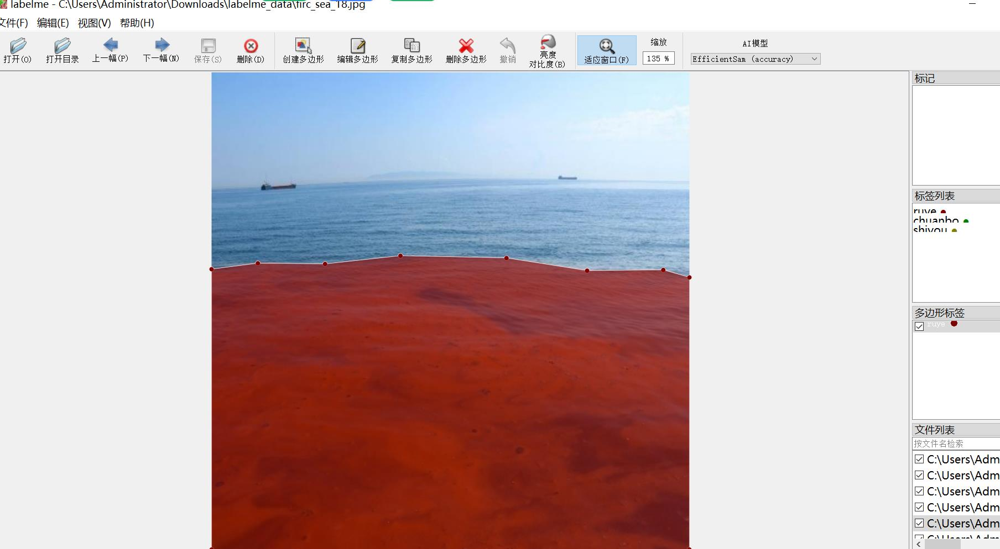
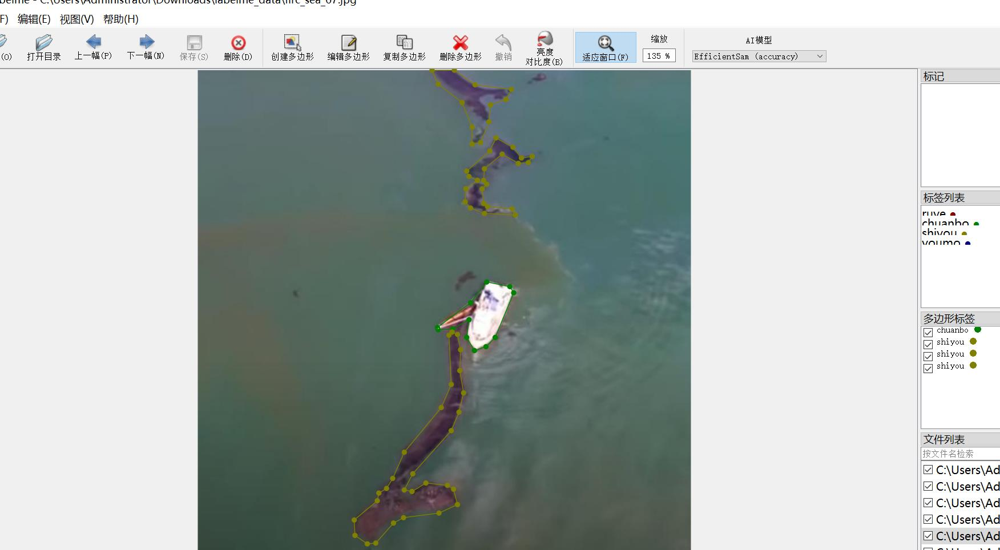
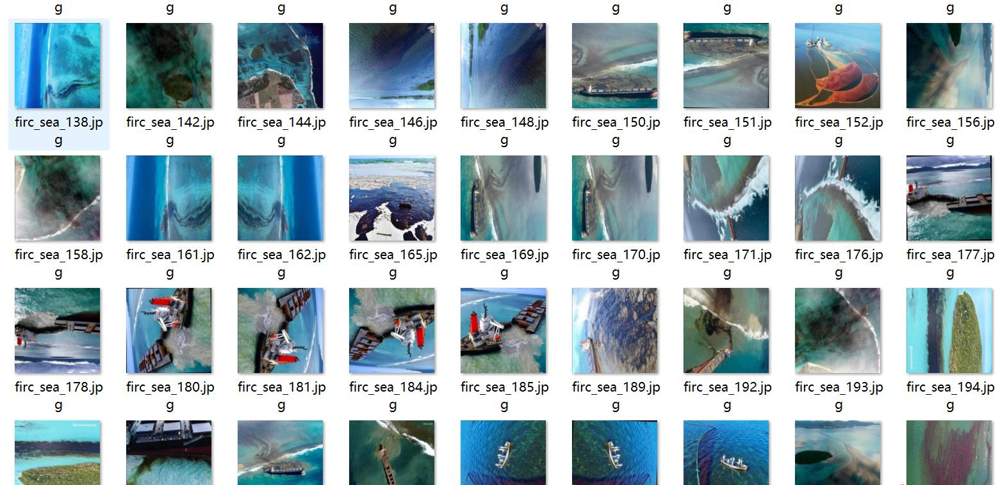
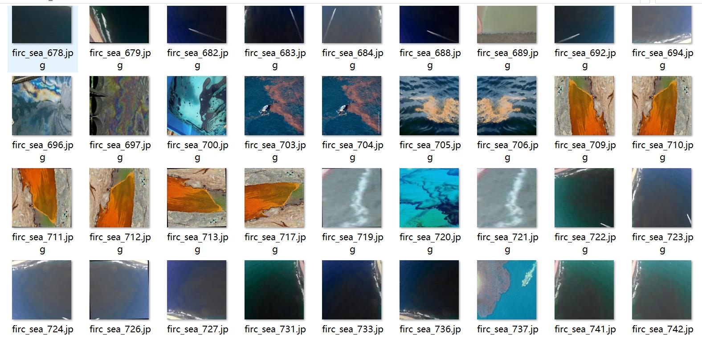
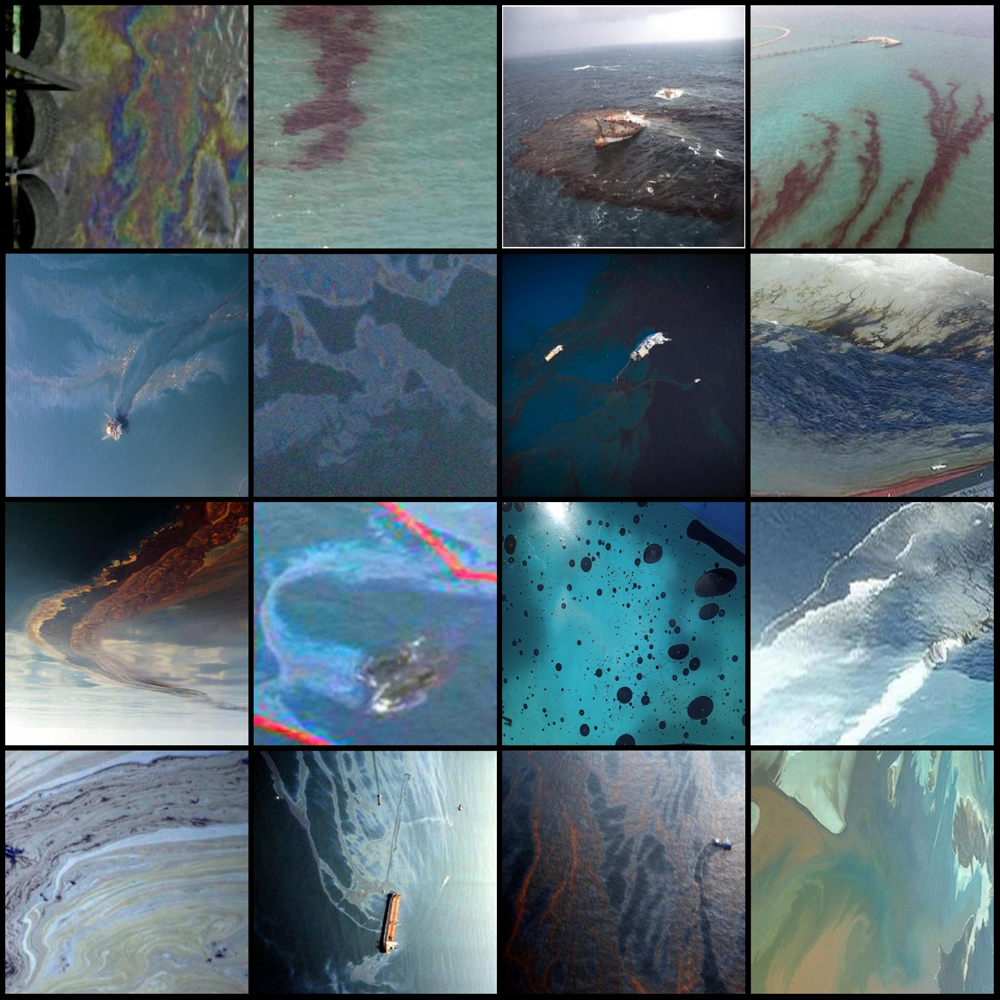
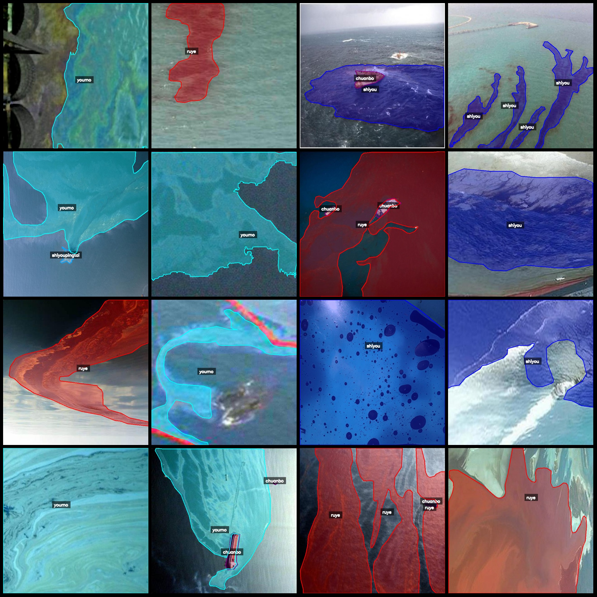

# Drone-Viewed Aerial Photos of Oil Spills and Pollution Identification Segmentation Data Set - labelme Format, 1212 Images in 5 Categories

**Note:** The dataset contains some image augmentations.
The dataset format is labeledme (without mask files, only including JPG images and corresponding JSON files).
There are 1212 JPG images.
There are 1212 JSON files.
The number of categories in the JSON files: 5
Category names in the JSON files: ["chuanbo", "ruye", "shiyou", "shiyoupingtai", "youmo"]
Corresponding Chinese category names: ["milk", "oil", "oil platform", "oil film", "ship"]
Number of boxes for each category:
- chuanbo count = 478
- ruye count = 634
- shiyou count = 790
- shiyoupingtai count = 27
- youmo count = 382
Total box count: 2311

Used labelme editor version: 5.5.0
Image resolution: 640x640
Annotation rules: Polygons are drawn around categories.
Important Notice: You can open this dataset with labelme for editing; if you want to use it for semantic segmentation or instance segmentation, you need to convert the JSON dataset into a mask or 
yolo format or coco format.
Special Notice: This dataset does not guarantee the accuracy of the trained models or weight files.
Labelme edit example image:

Annotation drawing result:

## Image

Here is a pay link on Stripe ( https://buy.stripe.com/3cs8yP7sY87d0vu9AB ). Please contact me lonlonago@foxmail.com after funding $89, and I will send you a complete data files , thank you!

